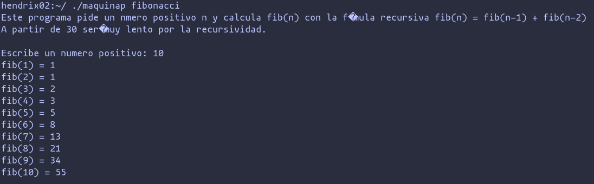

# Overview

The purpose of this project is to create a compiler for AdaC, a programming language that blends elements of C and Ada. This project aims to provide a practical learning experience by covering all the essential steps required to generate a compiler, from lexical analysis to code generation.

The tool used to develop this compiler is JavaCC.


# What is JavaCC?

Java Compiler Compiler (JavaCC) is the most popular parser generator for use with Java applications. A parser generator is a tool that reads a grammar specification and converts it into a Java program that can recognize matches to the grammar.

JavaCC generates top-down (recursive descent) parsers as opposed to bottom-up parsers generated by YACC-like tools. This allows the use of more general grammars, although left-recursion is disallowed. Top-down parsers have a number of other advantages (besides more general grammars) such as being easier to debug, having the ability to parse to any non-terminal in the grammar, and also having the ability to pass values (attributes) both up and down the parse tree during parsing.

By default, JavaCC generates an LL(1) parser. However, there may be portions of grammar that are not LL(1). JavaCC offers the capabilities of syntactic and semantic lookahead to resolve shift-shift ambiguities locally at these points. For example, the parser is LL(k) only at such points, but remains LL(1) everywhere else for better performance. Shift-reduce and reduce-reduce conflicts are not an issue for top-down parsers.

[JavaCC website](https://javacc.github.io/javacc/)


# Implementation

The implementation details of this compiler will be illustrated through the example of procedure and function declarations.


## Lexical analysis


Lexical analysis is the first phase of the compiler where the source code is converted into tokens. A token is a sequence of characters that represent a basic element of the language, such as keywords, identifiers, operators, and punctuation marks. The lexical analyzer reads the input characters and groups them into tokens.

In this project, lexical analysis is performed using JavaCC. Here is an example of the token definitions used for procedure and function declarations:


```java
TOKEN :
{
 	< #LETTER: (["a"-"z","A"-"Z"]) >
|	< #DIGIT: ["0"-"9"] >
|	< #ALPHANUM: (<LETTER> | <DIGIT>) >

}


TOKEN :
{
|	< tPROC: "procedure" >
		{
 		}
|	< tFUNCT: "function" >
		{
 		}
|	< tID: ("_"(<ALPHANUM>|<ALPHANUM>"_")* | <LETTER>("_"<ALPHANUM>|<ALPHANUM>)*("_")?) >
		{
 		}
}
```

## Syntax Analysis


Syntax analysis, or parsing, is the second phase of the compiler. It involves analyzing the tokens generated by the lexical analyzer to ensure they follow the grammatical structure of the programming language. The syntax analyzer constructs a parse tree that represents the hierarchical structure of the source code.

In this project, an LL(1) grammar is used to recognize the language. Here is an example of a grammar rule for procedure and function declarations:

```java
void declaracion_proc_func():
{
}
{
	(<tPROC> <tID> cabecera_proc()
	| <tFUNCT> <tID> cabecera_func())

	declaracion_variables()
	declaracion_procs_funcs()

	bloque_sentencias()
	
}
```


## Semantic Analysis

Semantic analysis is the third phase of the compiler, which ensures that the program is semantically correct. This involves checking for semantic errors such as type mismatches, undeclared variables, and scope violations. The semantic analyzer uses a symbol table to store information about identifiers (like variables and functions) and their attributes.

In this project, semantic analysis is performed as follows:

```java
void declaracion_proc_func(Attributes at):
{
	
	Token t1;
	String etiq;
}
{
	(<tPROC> t1 = <tID> cabecera_proc(at, t1)
	| <tFUNCT> 
	{at.type = tipo_variable();}
	t1 = <tID> 
	cabecera_func(at, t1))

	declaracion_variables()
	declaracion_procs_funcs(at)

	bloque_sentencias(at)
	{
		st.removeBlock();
	}
	
}
```

## Assembly code generation


Code generation is the fourth phase of the compiler, which translates the high-level constructs of the source code into assembly code or machine code. This involves converting the parse tree into a linear sequence of instructions that the target machine can execute.

In this project, assembly code generation is performed as follows:

```java
void declaracion_proc_func(Attributes at):
{
	
	Token t1;
	String etiq;
}
{
	(<tPROC> t1 = <tID> cabecera_proc(at, t1)
	| <tFUNCT> 
	{at.type = tipo_variable();}
	t1 = <tID> 
	cabecera_func(at, t1))
	{
		etiq = CGUtils.newLabel();
		at.code.addInst(OpCode.JMP, etiq);
	}

	declaracion_variables()
	declaracion_procs_funcs(at)
	{
		at.code.addLabel(etiq);
	}
	bloque_sentencias(at)
	{
		at.code.addInst(OpCode.CSF);
		st.removeBlock();
	}
	
}
```

## Error handling


Error handling strategies include:

- Simple Instruction Level: Panic mode recovery by skipping tokens until a synchronization token or semicolon is found.
- Conditional and Iteration Instruction Level: Panic mode recovery by skipping tokens until an 'end' is encountered.


# Example of execution

In this section, we will walk through the execution of a sample AdaC program that calculates the Fibonacci sequence. The program includes procedures for input handling and sequence computation, demonstrating various aspects of the AdaC language and the compilation process. We will compile the AdaC source code, generate the corresponding assembly code, translate this code into binary, and execute it on a P machine interpreter, ultimately observing the program's output.


## Example program

Here is the example AdaC source code for a Fibonacci sequence program:

```ada
procedure fibonacci is

integer i, n, r;

-----------------------------------------------------------
procedure cambiar_de_linea () is
-----------------------------------------------------------
begin
  put (int2char (13), int2char (10));
end

-----------------------------------------------------------
procedure dato (ref integer dato) is
-----------------------------------------------------------
boolean correcto;
    
begin
  dato := 0;
  correcto := false;
  while not correcto do
     put ("Escribe un numero positivo: ");
     get (dato);
     correcto := dato > 0;
     if not correcto then
        put_line ("El numero debe ser positivo.");
     end
  end
end

-----------------------------------------------------------
procedure fib (val integer n; ref integer r) is
-----------------------------------------------------------
integer r1, r2;

begin
  if n > 1 then
     fib (n - 1, r1);
     fib (n - 2, r2);
     r := r1 + r2;
  else
     r := n;
  end
end

-----------------------------------------------------------
begin
  put_line ("Este programa pide un número positivo n y calcula fib(n) con la fórmula recursiva fib(n) = fib(n-1) + fib(n-2)");
  put_line ("A partir de 30 será muy lento por la recursividad.");
  put_line ("");
  dato (n);
  i := 1;
  while i <= n do
    fib (i, r);
    put_line ("fib(", i,") = ", r);
    i := i + 1;
  end
  cambiar_de_linea ();
end
```

## Compilation

To compile the AdaC source code and generate the corresponding assembly-like code, execute the following command:

```bash
java -jar dist/adac_4.jar doc/adac/fibonacci.adac
```

This will produce an assembly-like output, fibonacci.pcode, which looks like this:

```assembly
  ENP L0
; --Comienzo de fibonacci
L1:
  JMP L2
L2:
; --coger constante entera 10
  STC 10
; --coger constante entera 13
  STC 13
  WRT  0
  WRT  0
  CSF
L3:
  SRF  0  3
  ASGI
  JMP L4
L4:
; --asignando
; --Variable dato
  SRF  0  3
  DRF
; --coger constante entera 0
  STC  0
  ASG
; --asignando
; --Variable correcto
  SRF  0  4
  STC  0
  ASG
L5:
; --coger variable correcto
  SRF  0  4
  DRF
  NGB
  JMF L6
; --coger constante string "Escribe un numero positivo: "
  STC 32
  STC 58
  STC 111
```

## Binary code translation

To translate the generated P code (program.pcode) into binary code (program.x) that can be executed by the P machine interpreter.

```bash
ensamblador programa
```


## Running the binary code

To run the binary code on the P machine interpreter, use the following command:

```bash
maquinap program
```


## Result of execution


